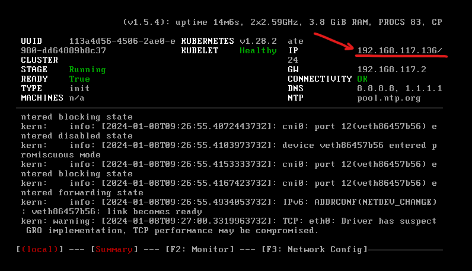
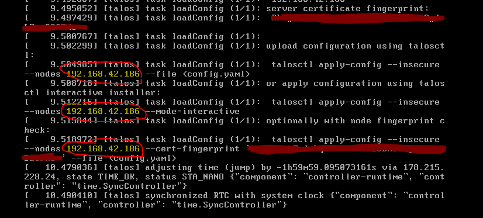

# Setup an IIoT-Box
The iiotctl tasks are wrapper functions using different cli-tools to make it easy to manage and build the configuration for a box. The tasks are like `make` scripts for python. Before these steps, it's necessary to collect some information about your new IIoT-Box.

This manual will show you how to create a new project or how to setup an IIoT-Box from an existing repository.

**General Requirements:**
- all steps require the proper setup of the tools / dev-machine (`iiotctl`, `asdf`, `gh`, ...): [Confluence: system requirements development environment](https://schulz.atlassian.net/wiki/spaces/SCHU/pages/2480701465)
- you are logged in with `gh` to a github account which was added to the Schulz Organization (you must log in via web-browser, not PAT)
- you are in the github team: `iiot-box-user` and in the right `teleport_*` team
- a teleport account (with access to: https://prod.teleport.schulzdevcloud.com)
- `iiotctl` version >= 2.0.0
    ```bash
    asdf install iiotctl 2.0.0 && \
    asdf global iiotctl 2.0.0
    ```


## Setup workflows:

### :new: New project:

0. [Prepare the machine](#0-prepare-a-bare-metal-box--virtual-machine)
1. [Create the repo with iiotctl](#1-create-the-project-locally-with-iiotctl-base-init)
2. [Setup project repo with iiotctl](#2-setup-project-repo-with-iiotctl-project-setup)
3. [Configure the machine config with iiotctl](#3-configure-the-machine-config-with-iiotctl-machine-resources)
4. [Apply to Machine](#4-apply-to-machine-with-iiotctl-machine-bootstrap)

### :arrows_counterclockwise: Recreating from an existing project:
0. [Prepare the machine](#0-prepare-a-bare-metal-box--virtual-machine)
1. [Create machine config from an existing repository](#create-machine-config-from-an-existing-repository)
2. [Apply to Machine](#4-apply-to-machine-with-iiotctl-machine-bootstrap)

## 0. Prepare a bare metal box / virtual machine
**Requirements:**
- the new machine is connected to the network
- the new machine is connected to a monitor and a keyboard
- boot talos on the new machine: https://github.com/SchulzSystemtechnik/iiot-base-box/blob/main/docs-base/booting-talos.md

1. startup the machine
    - boot (via UEFI/BIOS) the talos iso (from the stick on bare metal), this will take some minutes

    At this point talos is running in the RAM (maintenance mode) and it's possible to apply the machine config.
2. find out the ip-address of the box
    - look at the connected monitor / output of the vm, you should see the ip address at the top right corner of the screen, like shown in the following picture:
        

    - alternatively you should also see a log entry which looks like the entries in the following picture:
        

        (the IP address after the `--nodes` flag is the IP of the box)
    - (you can also look at your router config / web-ui to get the ip address)
    - note the ip address for later use

## 1. Create the project locally with `iiotctl base init`
This step copies the base project template from github to a local project directory on the developers PC.

**Suggestions**
- Create all your project repos in your `/repos` directory
    ```bash
    cd ~/repos
    ``````

**Steps**

1. Use iiotctl to create a new project (repo) and answer the dialog questions:
    ```bash
    iiotctl base init <path-new-project-repo>
    ```

    - choose a preset type for the machine (IIoT, GPU)
    - disable the advanced mode (if no special requirements)
    - choose a box-name (best-practice: repo name on github without the 'iiot-project' prefix)
    - choose an environment: *prod* if the box is used for a customer project, *dev* when you just need a test box
    - enter owner and name of the remote git repository in the format [OWNER]/[REPO_NAME]
    - (optional) choose additional system apps:
        - remote monitoring requires a grafana token (can be created later via `iiotctl`)


## 2. Setup project repo with `iiotctl project setup`
With the second step, the local project gets prepared to be bootstrapped onto the machine.

**Requirements**
- For the next steps ensure that you are in the project repo
    ```bash
    cd <path-new-project-repo>
    ``````

**Steps**
1. Execute the project setup task:
    ```bash
    iiotctl project setup
    ```
    This task performs the following steps automatically:
    1. Install / update all the necessary tools with specific versions required by the project on your development machine
    2. Generate all-encompassing deployment manifest for each system-app in its respective /argo directory
    3. Create project specific README.md file
    4. Setup the encryption key for sealed-secrets
    5. Setup access tokens for image registries (only for production) + acquire teleport join token (valid for 3 hours) and add it into the box setup secrets (+ acquire and setup token for remote-monitoring, *if selected in copier dialog*)
        > :warning: During **development box setup** is the user required to enter account names and corresponding tokens manually via a console input dialog:
        > - for docker: Enter docker username + a valid personal access token (PAT)
        > - for schulz-registry (harbor): Enter robot account name + corresponding token
        > - *(if selected in copier dialog)* for remote grafana: Enter grafana cloud policy access token name + token data
        >
        > see [here](https://github.com/SchulzSystemtechnik/iiot-base-box/blob/main/docs-base/development.md) for instructions on how to create the required tokens
    6. Do git stuff
       1. Set up local git repository
       2. make initial commit (-i)
       3. creating the repository on github
       4. push to newly created github repository
       5. add github deployment key


## 3. Configure the machine config with `iiotctl machine resources`
In this step the machine config is customized for the specific project.

**Requirements**
- Knowing the IP-Address from the PC and being in the same network.
    ```bash
    ping <ip-of-the-box>
    ```
- Knowing the network setup (used **DNS-server**, **ntp-server**)

**Steps**
1. Get the provided resources from the machine and select the right installer disk:
    ```
    iiotctl machine resources --patch <ip-of-the-box>
    ```
    > This command will print you the names of the network interfaces. These names are important for the interface configuration in the next step.
2. Setup the network in the patch files:
    - interfaces: `machine/config/network/interfaces.jq` (only required when the machine shouldn't use DHCP)
    - DNS-Server: `machine/config/network/nameservers.jq`
    - NTP-Server: `/machine/config/ntp/config.jq`
3. (optional) Setup additional k8s settings:
    - `/machine/config/k8s/additional-config.jq`
4. (optional) Setup additional registry endpoints / credentials:
    - registry endpoints: `/machine/config/registry-endpoints/additional-endpoints.jq`
    - registry credentials: `/machine/config/registry-credentials/additional-registry-access`


## 4. Apply to machine with `iiotctl machine bootstrap`
Now with the fourth step, the config will be applied to the machine.

**Requirements**
- Knowing the IP-Address from the PC and being in the same network.
    ```bash
    ping <ip-of-the-box>
    ```

**Steps**
1. Create the machine config and apply it directly to the machine:
    ```bash
    iiotctl machine bootstrap <ip-of-the-box>
    ```
    > use the --dry-run flag for testing

    The box will restart some times. After this the box should be connected to teleport and argo should manage the system apps. It can take about 15 min before everything works. If not, use the created config file (`<path-new-project-repo>/.tasks/talosconfig`). Look at [interaction with talos](/docs/interaction-talos.md) to see how to connect locally with talos.

2. Push the updated `talosconfig-teleport` and the created `config-sealed.asc`, `config.hash` files to github:
    ```bash
    git add . && \
    git commit -m "feat: update config files"
    ```
    ```bash
    git push origin main  # or your current selected branch 
    ```

3. Wait until the new box is ready and connected to teleport.
  
    **Optional VM ESX-server:** When the machine is ready (dashboard: `READY: TRUE`) you must upgrade the machine because the ova-image is already a complete talos installation and the extensions aren't installed automatically:
    ```bash
    talosctl config merge .tasks/talosconfig
    ```
    ```bash
    iiotctl machine upgrade-talos --use-current-context
    ```

4. Connect to argo and ensure that all apps are synced. If there is a sync error => try to sync the app again.
    ```bash
    iiotctl connect argo
    ```
    > Currently required because the ingress resource can't be applied when traefik isn't running (`IngressRoute` is defined by a traefik CRD).

**Finished !**


### Work with it

- interacting with Talos or Kubernetes via teleport:
    - [interaction with talos](/docs/interaction-talos.md)
    - [interaction with k8s](/docs/interaction-k8s.md)

- Now you can add a user-app in the `user-apps` dir ([add an user app](/user-apps/README.md))
    - For PStar machines: [local-system-ui](https://github.com/SchulzSystemtechnik/iiot-app-local-system-ui)
- For a production machine you should look at the checklist: https://github.com/SchulzSystemtechnik/iiot-base-box/blob/main/docs-base/checklist.md


## Create machine config from an existing repository
The next steps are pretty much identical to those from the [setup repo with iiotctl](#2-setup-project-repo-with-iiotctl-project-setup) section. Therefore, only the differences will be described now.
(Another option to setup a machine from an existing repo is to use the sealed config --> call the iiot-box developer)

1. clone the existing project repository to your machine
2. run an `iiotctl base update` (update to the same git reference as in the [.copier-answers file](/.copier-answers.yml)) to get the missing jq/yaml patch file templates that weren't checked into the project repository and are required to re-render box tokens:
    ```bash
    cd <project-repo> && \
    iiotctl base update --skip-answered -r {REFERENCE}
    ```
3. verify that the disk path and network settings match (see patch modification in [create the project locally](#1-create-the-project-locally-with-iiotctl-base-init))
4. upgrade the project.
    ```bash
    iiotctl project upgrade
    ```
    This task performs the following steps automatically:
    1. Install / update all the necessary tools with specific versions required by the project on your development machine
    2. Generate all-encompassing deployment manifest for each system-app in its respective /argo directory
    3. Create (if missing) / update project [README.md](/README.md) base- / talos- / k8s versions static badges
5. Setup the encryption key for sealed-secrets (all sealed secrets must be encrypted again):
    ```bash
    iiotctl project seal-secret --bootstrap
    ```
6. :warning: Check the network config. When you have a new hardware or VM the MAC addresses have changed.
7. :warning: Create and add a new deploy key for Github in:
    - [github-credentials.yaml](/system-apps/cluster-administration/machine-patches/initial-secrets/github-credentials.yaml)
    - [_initial-git-credential-manifest.boot.jq](/system-apps/cluster-administration/machine-patches/_initial-git-credential-manifest.boot.jq)
8. Setup not yet configured access tokens for image registries via the **box token provider**:
    - e.g. teleport join token (change time valid with option `--ttl` | default: 3h):
        ```bash
        iiotctl project create-token --teleport
        ```
    - e.g. if dockerhub access not yet configured in [docker-access.jq](machine/config/registry-credentials/docker-access.jq):
        ```bash
        iiotctl project create-token --docker
        ```
    - e.g. if schulz-registry access not yet configured in [schulz-registry-access.jq](machine/config/registry-credentials/schulz-registry-access.jq):
        ```bash
        iiotctl project create-token --schulz-registry
        ```
    - (optional) if remote monitoring is wanted, enabled and not yet configured in [secret.yaml](/system-apps/monitoring/argo/remote/victoria-metrics-agent/plain-secret/secret.yaml)
        ```bash
        iiotctl project create-token --grafana
        ```
9. select the right disk with iiotctl
    ```bash
    iiotctl machine resources --patch <ip-of-the-machine>
    ```
10. now apply repository to machine, following: [3. Apply to Machine](#3-apply-to-machine-with-iiotctl-machine-bootstrap)


## Nice to know
- it's possible to configure the initial iso with some kernel arguments to get a "initial image" with a static ip https://www.talos.dev/v1.5/reference/kernel/

### GPU Setup
- after the first config has been applied it's ok that there is an `error loading module gpu`

### Bootstrap the machine manually
1. Install / update all the necessary tools with specific versions required by the project on your machine:
    ```python
    iiotctl project setup-tools
    ```
2. Generate all-encompassing deployment manifest for each system-app in its respective /argo directory by typing the following command:
    ```python
    iiotctl project render-argo-manifests
    ```
3. Setup the encryption key for sealed-secrets:
    ```python
    iiotctl project seal-secret --bootstrap
    ```
4. Setup access tokens for image registries & (optionally) remote monitoring:
    ```python
    iiotctl project create-token --dev --schulz-registry --docker --teleport --grafana
    ```
5. Set up local git repository, make initial commit, push to newly created github repo, add deployment key:
    ```python
    iiotctl project configure-github-repo --initialize
    ```
6. Now create the initial machine config with local patch files (all patches are templated at this time)
    ```bash
    cd <project-repo>/machine && \
    iiotctl machine patch-config --gen --patch-file-pattern ... > new_mc.json
    ```
    - use patch-file-patterns to reference the patch files to be used (e.g. ... -p "foo*" -p "*bar" ...)
7. Apply the machine config
    ```bash
    talosctl apply-config --insecure --nodes <box-ip-address> -f <new-mc.json>
    ```
    The box will restart some times, after this the box should be connected to teleport and argo should manage the system apps.

    If not, use the created `machine/talosconfig` to connect to the device [connect to talos](/docs/connect-talos.md).
8. Connect with Talos or Kubernetes (see: [interact with k8s](interaction-k8s.md) or [interact with talos](interaction-talos.md))
9. Rewrite the `machine/talosconfig-teleport`:
    - ```bash
      cd <project-repo>/machine
      ```
    - open the generated `talosconfig` file and copy the value of the `ca` key
    - paste the value into `talosconfig-teleport` (`ca: ` field) 
10. Commit and push the `talosconfig-teleport` and the sealed secrets into the repository

