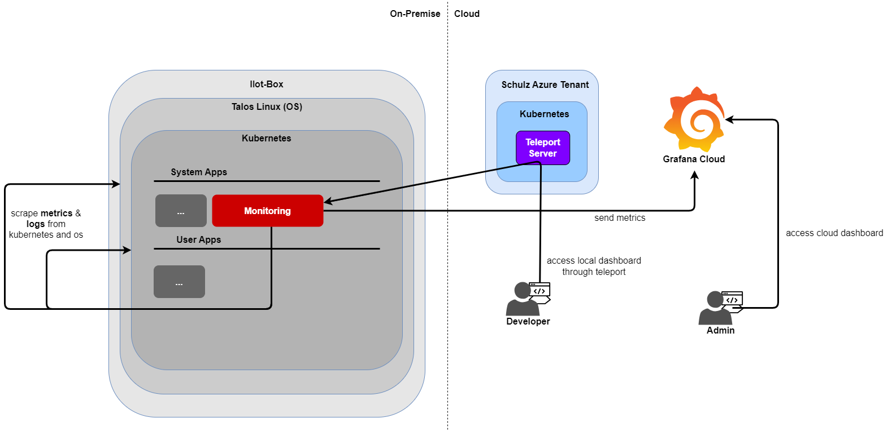
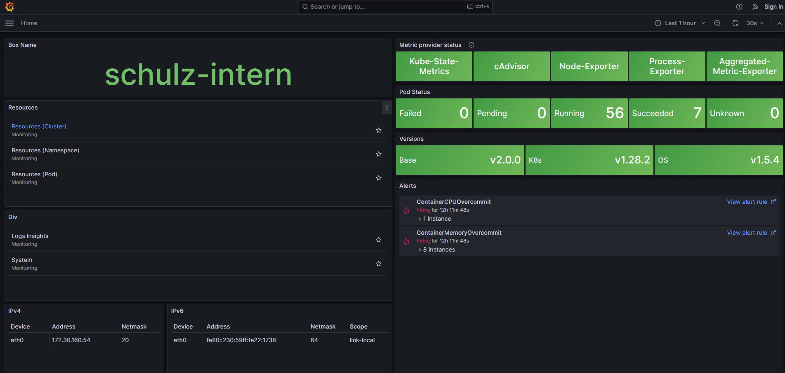
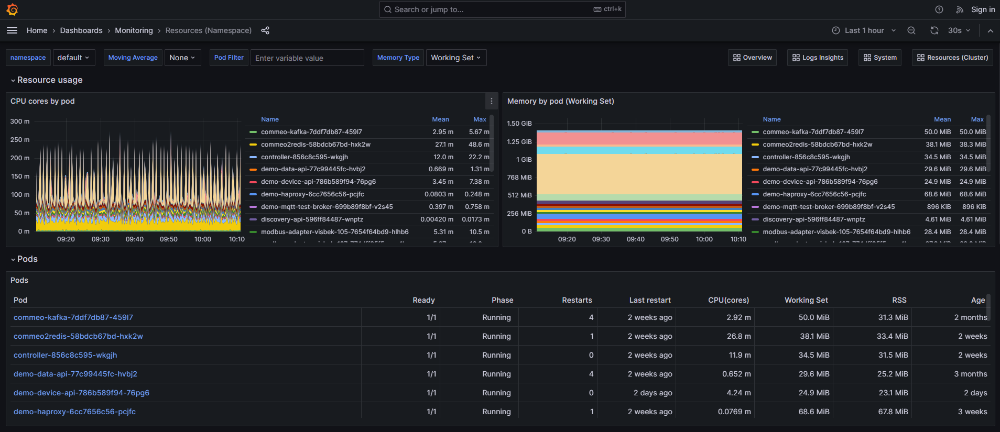
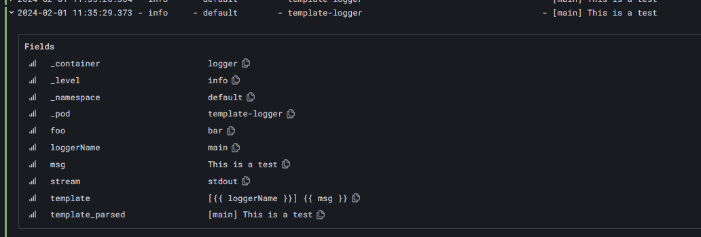

# Monitoring

## What is the monitoring

The monitoring app consists of the remote & local monitoring. The **remote** monitoring will push simple metrics (cpu, memory, pods running, etc.) to grafana cloud, where they are available in a dashboard. The **local** monitoring provides a much more detailed dashboard (metrics & logs), which runs completely without any outside connection and is only available, when a connection to the box is established (teleport, node-port, etc.)

## Overview

The following graphic shows, how the monitoring is accessed through teleport. The cloud dashboard is currently only for admins.

<!-- |   | -->
|  |
|:-------------------------:|
| Monitoring Components |

## Installation

    iiotctl base init

or

    iiotctl base update

## Access dashboard

  |  
:------------------:|:-------------------------:
Dashboard Overview  |  Dashboard Namespace Resources


- teleport: Access https://private-[box-name].prod.teleport.schulzdevcloud.com/monitor
- port-forward: `iiotctl connect traefik` > http://localhost:3000/monitor

## Manifest configuration

### Logging
By default, the logs collected from pods are not specifically parsed. Therfore, you need to define, how the logs are parsed, in order to later filter them in the dashboard.

#### Level
The log level is very important for the logging. With the level, the user can easily differ between more severe logs or not so important logs. It also brings the possibility to filter by the level.

The key of the level in the log line should always be `level`. The value of the level is always converted to lower.

Below is a table with all the levels and their possible values, which will be renamed to the corresponding level. Any unknown value will be mapped to 'unknown'. The original level will be saved int the key 'src_level'

| Level     | Color                                           | Supported expressions       |
| --------- | ----------------------------------------------- | --------------------------- |
| critical  | <span style="color:purple">purple</span>        | fatal, f, crit, critical, c |
| error     | <span style="color:red">red</span>              | err, erro, error, e         |
| warning   | <span style="color:yellow">yellow</span>        | warn, warning, w            |
| info      | <span style="color:green">green</span>          | info. i                     |
| debug     | <span style="color:blue">blue</span>            | dbug, debug, d              |
| trace     | <span style="color:lightblue">light blue</span> | trace, t                    |
| unknown   | <span style="color:grey">grey</span>            | *                           |


#### Annotations
To configure, how logs are collected, the following annotations can be used:

| Annotation | Description |
|:-------------------------------------------|:-------------|
| fluentbit.io/parser[_**stream**][-**container**]  | Suggest a pre-defined or custom [parser](#parser). The parser must be registered already by Fluent Bit. If present, the stream (stdout or stderr) will restrict that specific stream. If present, the container can override a specific container in a Pod. |
| fluentbit.io/exclude[_**stream**][-**container**] | Request to Fluent Bit to exclude (or not) the logs generated by the Pod. |
| fluentbit.io/rename-**container**             | Rename a container after collecting the logs of it. Useful for using [sidecar-container](#sidecar-container) |

##### Example
```yaml
apiVersion: v1
kind: Pod
metadata:
  name: logfmt-logs
  labels:
    app: logfmt-logs
  annotations:
    fluentbit.io/parser: logfmt  # This will parse the logs of all containers of this pod into 'logfmt'
    fluentbit.io/rename-logger: test  # This will rename the container 'logger' to 'test'
spec:
  containers:
    - name: logger  # This test-container logs a line in the logfmt format every second
      image: busybox:1.28
      args:
        - /bin/sh
        - -c
        - while true; do echo "level=info msg=\"This is a test\" foo=bar"; sleep 1; done

```

This output ...
```stdout
level=info msg="This is a test" foo=bar
level=info msg="This is a test" foo=bar
level=info msg="This is a test" foo=bar
```

... will be parsed into these lines

```
2024-07-25 14:39:37.809	- info     - default        - logfmt-logs-64957cf95-6lzj8                        - This is a test
2024-07-25 14:39:37.809	- info     - default        - logfmt-logs-64957cf95-6lzj8                        - This is a test
2024-07-25 14:39:38.185	- info     - default        - logfmt-logs-64957cf95-6lzj8                        - This is a test
```


#### Parser
Parsers are used to parse each line logged by a container, so that it can be structured and is filterable through the dashboard. There are predefined parsers. Custom parsers can be defined in the file [custom_parsers.conf](/system-apps/monitoring/argo/local/fluent-bit/config/custom_parsers.conf)

The following predefined public parsers are available ([details](/system-apps/monitoring/argo/local/fluent-bit/config/public_parsers.conf)):

| Name   | Format | Time Key  | Time Format            |
| ------ | ------ | --------- | ---------------------- |
| logfmt | logfmt | -         | -                      |
| json   | json   | -         | -                      |
| python | json   | timestamp | %Y-%m-%dT%H:%M:%S.%L%z |

#### Sidecar container
Some apps provide the functionality to log into a file as well as to stdout/stderr. This allows to specify a more structrured format (json/logfmt) for the file logger, and a more human readable format for stdout/stderr. Now we need to access the file to access all information of the logs. For that, we use a sidecar container, which tails the logs of the file into stdout. The following shows an example on how to add the sidecar container and use the annotations to format, exclude and rename the container logs. With that example, when looking at the dashboard, it appears as if the sidecar container doesn't exist and the logs are coming from the original container.

```yaml
apiVersion: v1
kind: Pod
metadata:
  name: logfmt-logs
  labels:
    app: logfmt-logs
  annotations:
    fluentbit.io/parser-log-collector: logfmt  # We set the format of the log-collector
    fluentbit.io/exclude-logger: "true"  # We exclude the original container, because we only want the detailed logs of the file
    fluentbit.io/rename-log-collector: logger  # We rename the container of the tail logger, so that in the dashboard it looks like the original container
spec:
  containers:
  - name: logger  # This test-container logs a line in the logfmt format every second
    image: busybox:1.28
    args:
    - /bin/sh
    - -c
    - while true; do echo "level=info msg=\"This is a test\" foo=bar" >> /var/log/app.log; sleep 1; done
    volumeMounts:
    - name: varlog
      mountPath: /var/log
  - name: log-collector
    image: busybox:1.36
    args: [/bin/sh, -c, "tail -n+1 -F /var/log/app.log"]  # Use tail to print the logs of the file to stdout
    volumeMounts:
      - name: varlog
        mountPath: /var/log
    resources:
      limits:
        memory: 10Mi
        cpu: 1m
      requests:
        memory: 1Mi
        cpu: 0.2m
  volumes:
  - name: varlog  # This volume shares the log file between the two containers
    emptyDir: {}

```

#### Templating
When using structured logging (e.g. json), it is possible to add a template with placeholder, which will format the log. The placeholder has to look like this: `{{ <key> }}`. The template must be delivered with the corresponding log line.

##### Example
```
{
  "timestamp": "02/01/2024 10:05:46",
  "msg": "This is a test",
  "level": "info",
  "loggerName": "main",
  "template": "[{{ loggerName }}] {{ msg }}"
}
```

The line above will produce the following line in the dashboard:

|  |
|:-------------------------:|
| Template Log |